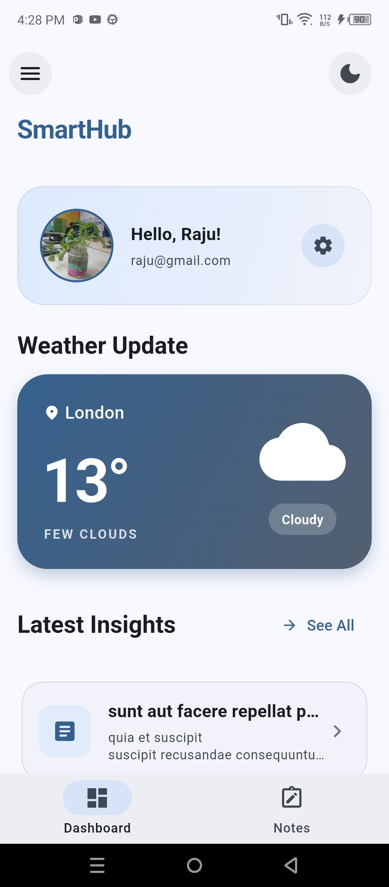
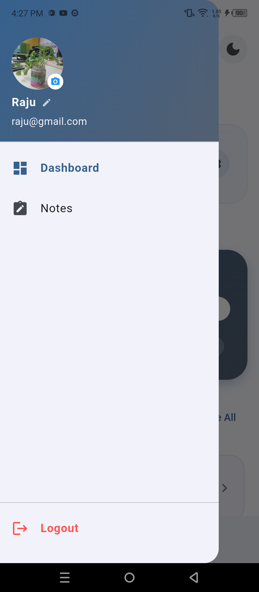
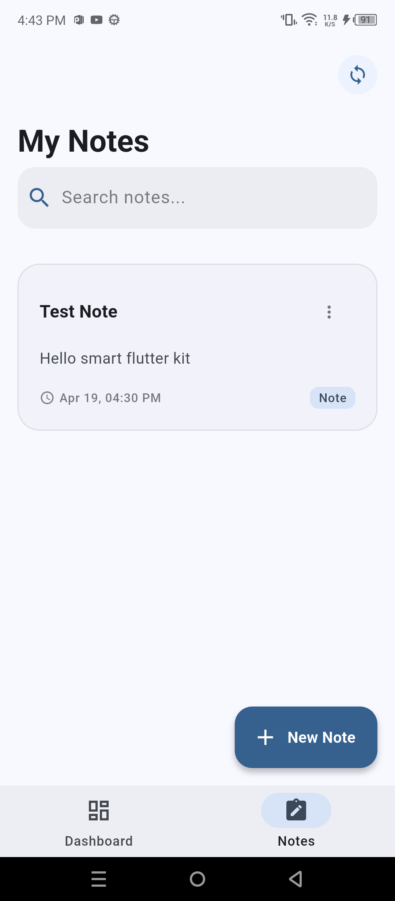
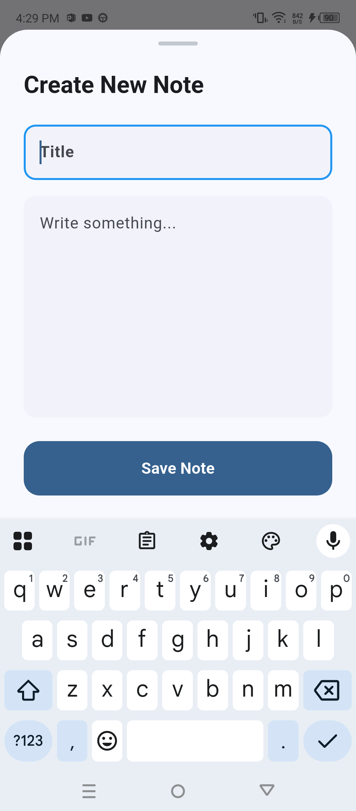
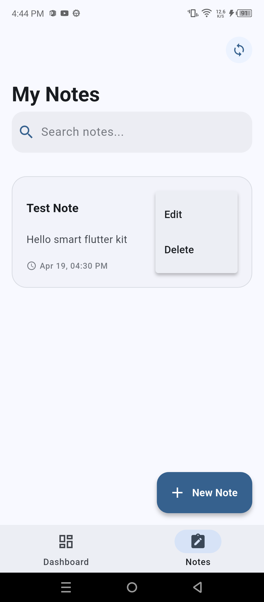

# SmartHub - Modular & Scalable Flutter Application

SmartHub is a professional-grade Flutter starter project designed with scalability, maintainability, and modern UI/UX principles in mind. It serves as a comprehensive dashboard and personal organizer featuring real-time weather, news insights, and a persistent local/cloud-synced notes system.

---

## 📸 App Showcase

| Dashboard (Light) | Side Drawer | Notes List | Create Note | Note Actions |
| :---: | :---: | :---: | :---: | :---: |
|  |  |  |  |  |

---

## 🏗 Architecture Pattern

SmartHub follows **Clean Architecture** principles combined with **Feature-first** folder structure. This separates business logic from UI and data handling.

### Architectural Flow:
1.  **UI (Presentation Layer):** Widgets watch Riverpod Providers to display state.
2.  **State Management (Riverpod):** Controllers (StateNotifiers) manage state transitions and talk to Repositories.
3.  **Domain Layer (Repositories):** Abstract interfaces defining what the app can do.
4.  **Data Layer (Implementation):** Concrete repository implementations that fetch data from APIs (Dio) or Local Storage (Hive/Firestore).

---

## 🚀 What We Learned
*   **Modular State Management:** Using Riverpod to manage complex, interlinked states like Auth and Data fetching.
*   **Offline-First Strategy:** Implementing Hive for local persistence with manual Firestore synchronization.
*   **Adaptive UI:** Building a single codebase that looks great in both Light and Dark modes using Material 3.
*   **Clean Code Practices:** Refactoring large widgets into smaller, reusable components.
*   **Firebase Integration:** Handling real-time authentication, cloud storage for profile images (Base64), and Firestore batch updates.

---

## 📚 Project Glossary (Keywords)

*   **`Provider` (Riverpod):** A container that holds a piece of state and allows different parts of the app to access it.
*   **`FutureProvider`:** Used for handling asynchronous operations (like fetching weather) and providing the state (loading, error, or data) to the UI.
*   **`StateNotifier`:** a class that holds a state and defines methods to update it safely.
*   **`Sliver`:** Specialized scrollable areas (like `SliverAppBar`) that allow for high-performance, complex scrolling effects.
*   **`Hive`:** A lightweight, blazing-fast key-value database for Flutter (used for local notes).
*   **`FirebaseFirestore`:** A NoSQL cloud database for syncing user data across devices.
*   **`withValues(alpha: ...)`:** The latest Flutter API for handling color transparency without precision loss.
*   **`CustomScrollView`:** A widget that creates a scrollable area using slivers, providing complete control over scroll effects.

---

## 📂 Development History (File Log)

| File Name | Reason for Modification |
| :--- | :--- |
| `main.dart` | Configured Global Theme (Material 3), initialized Firebase & Hive. |
| `auth_repository.dart` | Defined interfaces for User Login, Profile updates (Name & Pic). |
| `auth_provider.dart` | Managed the Auth state and provided methods for profile editing. |
| `auth_screen.dart` | Built the Login/Signup UI with form validation. |
| `main_screen.dart` | Created the core navigation shell and the Interactive Side Drawer. |
| `dashboard_screen.dart` | Designed the main dashboard with Weather, User Greeting, and News. |
| `notes_screen.dart` | Developed the full CRUD (Create, Read, Update, Delete) system for notes. |
| `notes_provider.dart` | Handled note searching, local storage logic, and cloud sync. |

---

## 🛠 Step-by-Step Development Guide

1.  **Setup:** Initialize the project with dependencies (Riverpod, Dio, Hive, Firebase).
2.  **Core Core:** Setup `ThemeNotifier` and `DioClient` for global use.
3.  **Authentication:** Build the Auth Repository and UI to handle user sessions.
4.  **Dashboard Design:** Implement `CustomScrollView` with Slivers for a modern look.
5.  **Data Integration:** Connect Weather and News APIs using `FutureProvider`.
6.  **Notes Feature:** 
    *   Create Hive Model & Generator.
    *   Build the Notes UI with Swipe-to-Delete.
    *   Implement "Edit Note" via `showModalBottomSheet`.
7.  **Cloud Sync:** Add Firestore logic to backup local Hive notes to the cloud.
8.  **Polishing:** Final UI adjustments, fixing deprecations, and adding the Side Drawer functionality.

---

## 📦 Required Dependencies

*   **`flutter_riverpod`:** For reactive and modular state management.
*   **`dio`:** For making optimized HTTP requests to Weather and News APIs.
*   **`hive` & `hive_flutter`:** For super-fast offline data storage.
*   **`firebase_auth` & `cloud_firestore`:** For user security and data synchronization.
*   **`image_picker`:** To allow users to select profile pictures from their gallery.
*   **`intl`:** For formatting dates and timestamps on notes.
*   **`uuid`:** For generating unique IDs for local notes.

---
*Developed with ❤️ as a modern Flutter showcase.*
